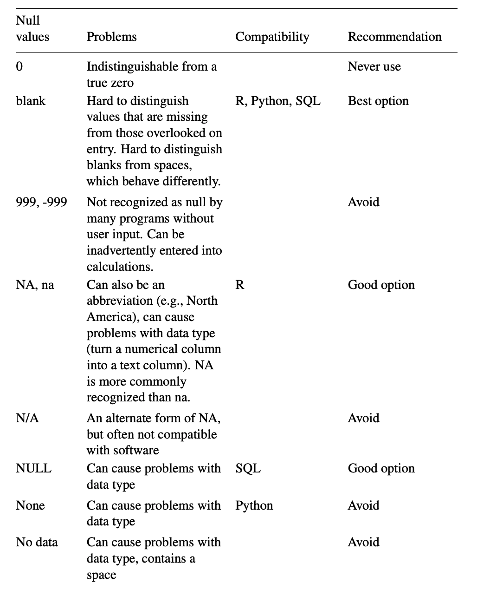

## Week 2
### 数据的类型
  - 定类/名义（nominal/categorical/set of characters）：描述特征，不具有数值意义。如名字、性别、民族、车辆品牌、地点
  - 定序（ordinal/sequence）：分类和排序都有意义。如教育水平、问卷中的偏好程度等
  - 定距（interval）：没有绝对0点，数值间距相等，互相可以加减，但乘法无意义。如摄氏度、IQ
  - 定比（ratio）：有绝对0点（true/meaningful zero point），一个值是另一个值的倍数或比率，可计算差、中位数、均值等。如质量、高度、速度
  - 离散（discrete）：整数
  - 连续（continuous）：小数点位数没有限制
  
### 数据录入（课堂练习1）
  - “列”对应变量，“行”对应信息录入（columns for variables & rows for observations）
  - 每一格应该只对应单一信息
  - 命名时避免数值、空格和特殊字符，数值单位需指明
  - “0”和“空白”的差异（0是数值，空白是null）
    
  - 数据核验
  - 输出时应导出为csv等通用格式
  - 输出时应附上元数据（metadata: data about data）

### The Eyeball Test “眼睛雪亮”（课堂练习2）
  - 提问：5W & H
  - command+箭头
  - 每一列记录的是什么信息？数据单位是什么？数据类型是什么？
  - 每份数据应该有一个说明和元数据，找出数据背后的上下文
  - 字符是英文还是中文，输入时有空格吗，有空白数据吗
  - 练习2：2017年蔬菜产量最高的10个国家是？（数据：[联合国粮农组织](http://www.fao.org/faostat/zh/?#data)）

### 数据处理
  - csv导入，文档编码与乱码 (tsv, fixed width)
  - 冻结首排，开启过滤功能
  - 排序(sorting)
  - 过滤(filtering)
  - 公式(functions，👇🏻阅读5)
    - sum(), average(), median()
    - upper(), lower(), proper()
    - concatenate(), trim()
    - left(), right()
  - 数据透视表（pivot tables）
  - Excel bugs：[行数](https://blog.csdn.net/zhongguomao/article/details/77737800),[日期](https://www.cnblogs.com/guogangj/p/9419453.html)
  
### Tips
  - 保存、保存、保存
  - 记录每一步操作
  - 数据备份，不更改原始数据（raw data）
  - 如果已经有了机构的分析，依然要做完你自己的分析来核实
  - 了解你的数据后再动手
  - 和同仁交叉核对
  - 如果条件允许，去实地调查数据是如何被收集及记录的

**作业（10月9日前提交）**
1. 搜索并阅读《上海市公共数据开放暂行办法》
2. 搜索并回答：我国还有哪些关于公共数据开放的条例或法规？国内外有哪些政府开放数据平台？（markdown文档，列出信源和链接，包括👆🏻上海这个）
3. 在国家统计局[数据库](http://data.stats.gov.cn/index.htm)找到全国GDP数据，回答：2012-2018年各季度GDP增速（列出选取的统计指标、数据页面、计算步骤及答案）
4. 阅读👇🏻的材料

**阅读**
1. [《什么是政府统计》](https://cosx.org/2019/08/what-is-gov-stats/)
2. [《电子表格中的数据整理》](https://cosx.org/2018/07/data-organization-in-spreadsheets/)
3. Hadley Wickham, [_Tidy Data_](https://www.jstatsoft.org/article/view/v059i10)
4. Ethan P. White, [_Nine simple ways to make it easier to (re)use your data_](https://peerj.com/preprints/7/)
5. Microsoft, [_Top ten ways to clean your data_](https://support.office.com/en-us/article/Top-ten-ways-to-clean-your-data-2844b620-677c-47a7-ac3e-c2e157d1db19)

* * *

## Week 1
- 对数据的“背景调查”：Who, What, When, Where, Why, How?
  - 不管发布机构有多权威，数据都是可质疑的
  - 人工会不同程度地参与数据整合过程，难免偏差与错误：To err is human.
  - 永远检查数据集的元数据（Metadata）
- 个人数据的价值：[Dear Data](https://www.dear-data.com/theproject)
- GitHub 及 Markdown
  - GitHub Pages 主题选择：[https://pages.github.com/themes/](https://pages.github.com/themes/)
  - Markdown Cheatsheet：[https://github.com/adam-p/markdown-here/wiki/Markdown-Cheatsheet](https://github.com/adam-p/markdown-here/wiki/Markdown-Cheatsheet)
  - Markdown 教程：[https://www.markdowntutorial.com/](https://www.markdowntutorial.com/)

**作业（9月30日前提交）**
1. 收集某个主题的个人数据，不限时间，规整为数据集
2. 参考 Dear Data 的表现方式，拓展想象力
3. 以手绘的形式呈现第一步收集的数据（无所谓美感，能展现想法为主），纸张大小 ≥ 明信片
4. 以 markdown 文档形式记录自己的上述过程操作或感想
5. 在同一个 markdown 文档里回答：你认为日常生活中哪些数据是被搜集的？被谁搜集了？

* * *
 
## 课程目标
- 锻炼信息获取、辨别及核实的能力
- 锻炼数据处理及分析的能力
- 基本设计概念与图表制作
- 教学相长

### 软件准备
- Excel, Ai, R, Sublime Text

### 参考阅读
- [Data Journalism Handbook](https://datajournalism.com/read/handbook/two)
- [Data + Design](http://orm-atlas2-prod.s3.amazonaws.com/pdf/13a07b19e01a397d8855c0463d52f454.pdf)

### 评分
- 平时作业 60%
- 期末项目 30%
- 课堂参与 10%

平时作业包含软件操作、信息搜集、数据申请或数据分析等。期末项目要求在与老师讨论后，独立完成一个以采访为基础、数据驱动、包含信息设计与呈现的作品。

### 加分项
- 数据获取难度高
- 数据处理和分析有明晰记录

### 扣分或直接不及格项
- 援引内容不注明信源或链接
- 使用二手数据，未经核实的数据
- 信息获取方式不合伦理（如采访时没公开记者身份等）
- 编造信息或内容
- 大段改写或抄袭
- 缺勤6次以上

### 隐私
- 课堂上的拍照、录音和录像仅供个人学习使用，未经当事人书面允许请勿任意传播
- 互相尊重，不合适言行当面指出
