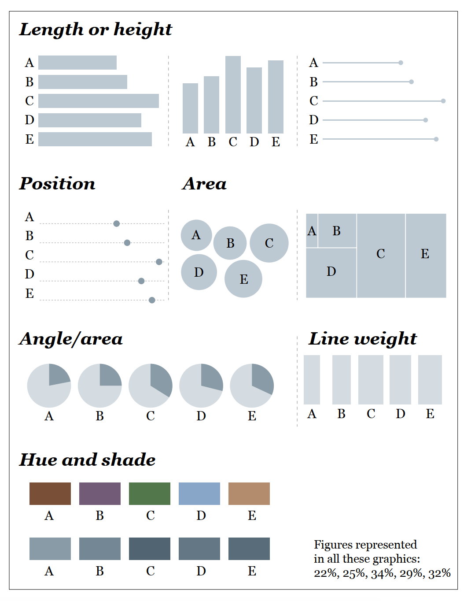
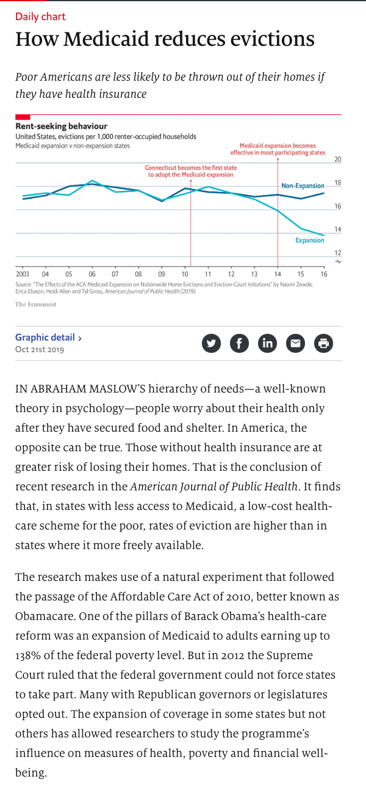
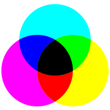
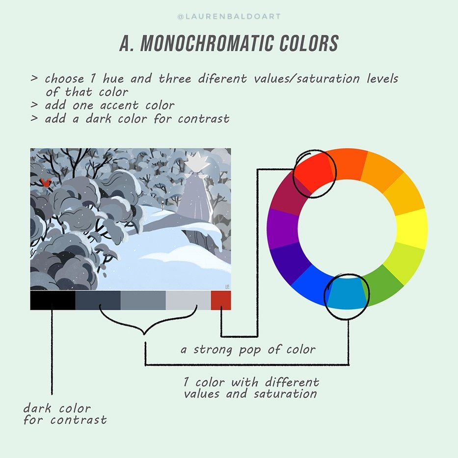
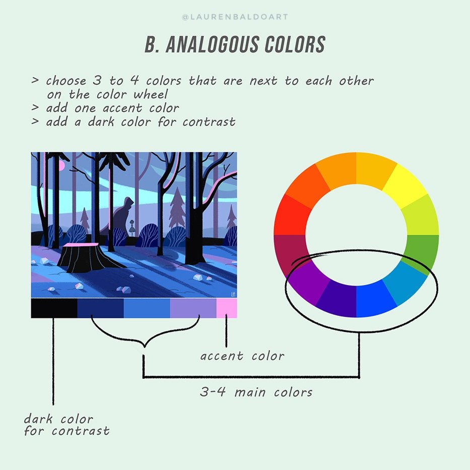
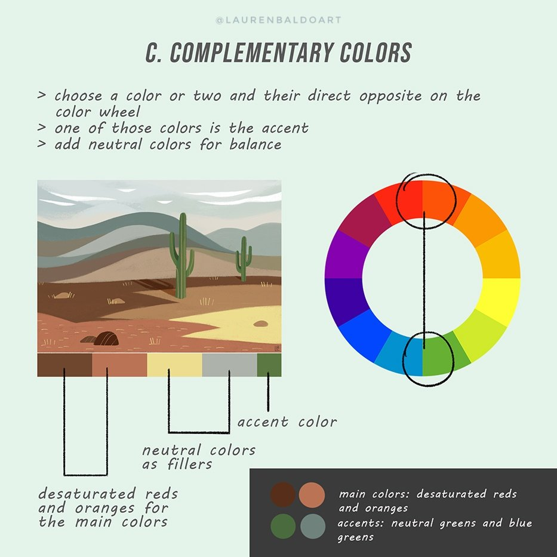
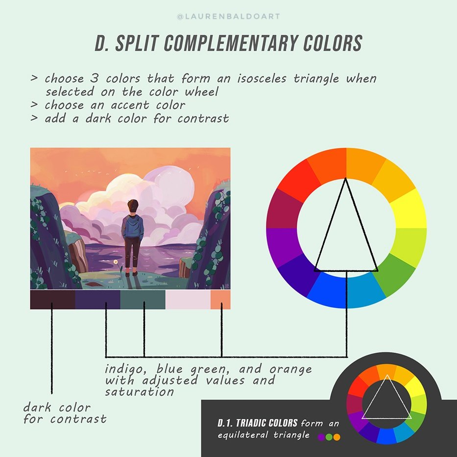

### Week 9

  
本周作业

  
##### `11月26日中午前`提交
- 任选自己在“垃圾”或“未成年人犯罪”两次作业里做过的**两张**图（及数据）
- 使用ggplot2复刻（或重新制作）
- 提交的 markdown 里包括1️⃣之前的原图和ggplot图 2️⃣实现用的代码
- 考核点：在 R 里导入数据，用 ggplot2 进行基础绘图
- **如果你用 python 能复刻，提交 python 代码也行**

  
R

##### 在 R 里导入数据
- 导入csv或excel文件
- 利用api接口导入（tushare包）

##### 图形语法 Grammar of graphics

##### 做图示例及导出

---

### Week 7-8

  
本周作业

##### `11月20日中午前`提交
- 发邮件讨论对于期末项目的想法
- **关于期末项目**
  - 形式：不限（呈现的文本不超过5000字）
  - 题材：不限
  - 考核点：信息/数据搜集、呈现逻辑、内容梳理、作品美感
  - 加分项：数据获取难度（例，因公共议题向政府部门索要未公开数据）
  - 提交日期：不晚于12月20日
  
##### 不用提交、全靠自觉的练习
- 用 Web Scraper 抓取网站，如：http://ldzl.people.com.cn/dfzlk/front/firstPage.htm
- 熟悉 RStudio 界面及基础指令

  
形式与功能

#### 看作品的思考角度

下面这些功能，它有哪些？
- 展示
- 比较
- 组织
- 关联

#### 形式和功能的取舍
- 重形式派代表：`Nigel Holmes`
  - http://www.nigelholmes.com
  - 幽默的力量 Using humor to inform
  - “通常，让读者开心的成分有助于他们记住你的图表”
  - 演讲：https://www.youtube.com/watch?v=WB7DCEayj3w

- 重功能派代表：`Edward Tufte`
  - https://www.edwardtufte.com/
  - 数据—油墨比 data-ink ratio（印刷时代）
  - YouTube频道：https://www.youtube.com/user/EdwardTufte
  
- **形式常常受制于功能，但你依然拥有选择权**
  - 可视化轮盘
  - 抽象/模拟，实用/修饰，致密/稀疏，多维/一维，创新/通用，简洁/冗余
  - 灵活选择，不要刻板

  
R

#### 操作

1. 设置工作环境
2. 安装、运行R程序包
3. 在R里寻求帮助
4. 使用R程序包自带的例子、演示和数据

#### 基本点
- 代码的**大小写**很重要，写命令时尤其要注意
- **符号**
  - `>` 代表一段 R 程序的开始  
  - `+` 是续行符，当一段程序在某一行没有完整显示时，会折到下一行，此时 R 会以 `+` 来表示程序语句在继续
  - `#` 代表注释，即不会被执行的语句（但写给自己和合作者看很有用）
- 函数基本语法
  - `函数名字(参数1, 参数2, … )`
  - 这里的括号 `()` 代表函数内容，而 `,` 分隔参数设定
- Tab 键和 Esc 键
  - `Tab` 可以引导你写完函数
  - `Esc` 可以让你退出代码的黑洞

#### 学习资料
- 各种教程、教材：https://bookdown.org/
- 谢益辉《现代统计图形》：https://bookdown.org/xiangyun/msg/history.html
- Web Scraper: https://www.webscraper.io/

---

### Week 6

  
本周作业

  
##### `11月13日中午前`提交

- **形式：** 图文（图最多两张；文字不超过1000字，写多了不扣分；请用中文书写）
- **新闻由头：** https://thepaper.cn/newsDetail_forward_4791263
- **关键词：** 未成年人保护法、未成年人犯罪
- **考核点：** 
  - 信息/数据搜集能力，资料消化、内容梳理能力
  - 制作过程说明详细
  - 言之有物、逻辑自洽
- **提交的markdown文档应包括：**
  - 最终的图文呈现（1）
  - 过程步骤（2）：信息/数据搜集、选题角度确立的过程；数据分析和呈现的考虑与步骤
  - 信息/数据来源链接（3）

  
什么是合适的图表

#### 什么样的图表适合我的数据？

- 方式一：从图表类型起步 Top-down
  - FT Visual Vocalbulary[《金融时报》图表指南](https://github.com/ft-interactive/chart-doctor/blob/master/visual-vocabulary/Visual-vocabulary-chinese-simplified.pdf)
  - Chart Suggestions — A [Thought-Starter](https://extremepresentation.typepad.com/files/choosing-a-good-chart-09.pdf)
  - 数据可视化工具[目录](https://datavizcatalogue.com/ZH/)

- 方式二：Bottom-up
  - 从元素起步
  - 尝试不同的表现形式  
  

#### 怎样优化图表？

总原则：要呈现给读者的是故事，不是数据
- 数据点越多越复杂，读者“秒懂”的信息越少
- 你的信息图有重点吗？

**怎么说重点？**

颜色
- 用颜色来“合并”类似数组
- 用灰色来“隐去”背景数据

数值
- 每一个点需要标出吗？
- 每个值需要标出吗？
- 数值需要排序吗？
- 数组少就直接标吧

图例
- 没取整的数值型图例谁能“秒懂”？
- 多个区间的数值型图例可以横着放
- 考虑颜色/值标出多少合适

  
期末项目该准备起来了

### 不用编程的数据抓取，给自己的数据更多可能

- **工具**  
[webscraper.io](https://www.webscraper.io)
- **用途**  
抓取“规则”的网页，如：知乎某问题答案、网站文章列表等

### 只看新闻做不好新闻

找信息的渠道包括但不限于：
- 中外媒体报道（深度长篇报道）
- 相关多媒体制作，如纪录片等（帮助自己了解别人的叙事逻辑）
- 智库、数据库（等其他数据库）
- 相关书籍或文献（国图网站用起来）
- 社交媒体上的大众讨论（twitter、微博、reddit、知乎等）
- 关于该议题的线下讲座、论坛、活动（如[“中法环境月”](https://cn.ambafrance.org/%E4%B8%AD%E6%B3%95%E7%8E%AF%E5%A2%83%E6%9C%88-37046)和“垃圾”选题）

**别太懒太天真**
- 太懒：不假思索，照搬报告里的观点
- 太傻：天知道它的内容多大水分、鬼知道它是不是公关软文，你怎么就都信了
- 请注明**不是你自己的观点**的出处，不背别人立场的锅

**别对历史一无所知**

友好型阅读材料：何伟[《甲骨文》](https://book.douban.com/subject/6539859/)，请自行检索电子版

---

### Week 4-5

  
本周作业

##### `10月29日中午前`提交

- 以“垃圾”为题搜集数据和资料，**不限角度和数据量、国内/国外的数据集都可以用**
- 经过资料整合和数据分析后，以图文的形式呈现议题（图表 < 3张，文字 300-800 字）
- markdown文档应包括：
  - 最终的图文呈现（1）
  - 过程步骤（2）：数据来源；过程中参考的资料、数据收集过程；数据分析和呈现的步骤
  - 选择报道角度的思考过程（3）
- 制图不限所用工具

##### 评分标准
- 切入“垃圾”这个议题的角度（信息搜集、整合能力）
- 数据选择的合理性（对数据的理解）
- 制图的质量（呈现能力）
- 篇幅精简、直击重点，参考：[Graphic Detail](https://www.economist.com/graphic-detail/2019/10/21/how-medicaid-reduces-evictions)，不用面面俱到，而是言之有物  

  

  

  
色彩

 
#### [色彩基础](https://www.bilibili.com/video/av12369672/)
- **原色、间色、复色**
  - 原色 Primary Colors  
  指不能透过其他颜色混合调配而得出的“基本色”，三原色“红、黄、蓝”
  - 间色/二次色 Secondary Colors  
  由两种等量的原色混合而成，如橙=红+黄、紫=红+蓝、绿=蓝+黄
  - 复色/第三色 Tertiary Colors  
  由色轮上的间色与其相邻的原色混合而成，如黄橙色、蓝紫色
  - 互补色 Complementary Colors  
  色轮上二次色与其正对面的原色为互补色，如红色与绿色、蓝色与橙色

- **色彩三属性**：色相、饱和度、明度
  - 色相 Hue  
  简单来说，就是色轮上的12种颜色，如红色，黄色
  - 饱和度/色度 Saturation  
  指某个颜色的强度，数值越高色彩越纯，低则逐渐变灰
  - 明度/亮度 Value  
  指颜色的亮度：往一个颜色里加白色，明度就提高；反之加黑色，明度降低。两个极端就是黑、白两色
  
- **RGB** vs **CMYK**
  - RGB [三原色光模式][rgb]：**适用于电子屏幕**，三种颜色的光聚在一起形成白光，缺乏光（屏幕关闭）即是黑色  
  
  
  - CMYK [印刷四分色模式][cmyk]：青色 Cyan、品红 Magenta、黄色 Yellow、黑色 Key，**适用于印刷品**  
  由于现实情况中，前三种颜色的油墨叠印而成的并不是纯黑，所以需要专门定位标准的黑色，称为Key。没有油墨即是白色  
  

[rgb]: https://zh.wikipedia.org/wiki/%E4%B8%89%E5%8E%9F%E8%89%B2%E5%85%89%E6%A8%A1%E5%BC%8F "RGB mode"
[cmyk]: https://zh.wikipedia.org/wiki/%E5%8D%B0%E5%88%B7%E5%9B%9B%E5%88%86%E8%89%B2%E6%A8%A1%E5%BC%8F "CMYK mode"

#### 色彩[搭配](https://colorsupplyyy.com/app/)
- **单色** Monochromatic  

- **类似** Analogous  
色轮上彼此相邻的颜色组成  

- **互补** Complementary  
色轮中完全对立的颜色为互补色  

- **等边互补** Split Complementary  
选择一种颜色，再在色轮上找出它正对面的互补色；  
不直接使用这个互补色，而是使用该互补色两侧的颜色

#### 基于数据的[色彩选择](https://blog.datawrapper.de/colors/)
- **离散型**色系 Diverging  
两端颜色为互补色（如红色与绿色），中段颜色通常较浅；可以强调中间值域，并且使得两端的数据一目了然，适合偏重极值和中间值的数据  

- **序列型**色系 Sequential  
一般是同一色调（Hue）的由浅及深或由深至浅；数值较小用浅色，较大用深色，适合单一主题、比重比较平均的数  

- **分类型**色系 Qualitative/Categorical  
分类型的每种颜色都“各不相关”，采用不同色调；适合用来区分不同种类下的数据，如区分土地用途  

- **ColorBrewer** [演示](http://colorbrewer2.org/#type=sequential&scheme=BuGn&n=3)

   

  
字体、排版

#### 排版与[字体基础](https://www.bilibili.com/video/av12368230/)
- 衬线、非衬线体
  - Serif
  - Sans Serif
  
- 空间：Kerning, Tracking...
  - Kerning
  - Tracking
  
- **排版原则**
  - 亲密性 Proximity
  - 对齐性 Alignment
  - 对比性 Constrast
  - 重复性 Repitition
  - 留白与“降噪”
  

  
阅读及资料

  
- **色彩**
  - Datawrapper，[性别与颜色](https://blog.datawrapper.de/gendercolor/)
  - Datawrapper，数据可视化[如何更好地使用颜色](https://blog.datawrapper.de/colors/)
  - 浮世绘，[富岳三十六景](https://www.shuge.org/ebook/thirty-six-views-of-mount-fuji/)
  - 看到色弱者眼中的颜色？使用 Chrome 插件[Colorblindly](https://github.com/oftheheadland/Colorblindly)
  
- **字体**
  - TIB，城市字体观察：[招牌备忘录](https://thetype.com/2017/12/13856/)
  - TIB，跨文化[文字设计](https://thetype.com/2018/12/16247/)
  - TIB，孔雀计划：[中文字体排印的思路](https://thetype.com/kongque/)
  - 日本火柴盒贴画[集萃](https://www.shuge.org/ebook/ri-ben-huo-hua-she-ji-ji-cui/)
  - 姜庆共，[《上海字记》](https://book.douban.com/subject/30136454/)
    
- 设计的**可及性**
  - 好的设计“触及”所有人，如考虑颜色是否对色弱人群友好、网站可搜度[等等](https://uxdesign.cc/designing-for-accessibility-is-not-that-hard-c04cc4779d94)
  - 腾讯，[设计关怀](https://cdc.tencent.com/2011/03/09/%E7%89%B9%E6%AE%8A%E4%BA%BA%E7%BE%A4%E7%9A%84%E8%AE%BE%E8%AE%A1%E5%85%B3%E6%80%80/)
  

---

### Week 3

  
展开

    
#### 又是 Markdown
- Markdown 诞生于2004年，由 John Gruber（在 Aaron Swartz 协助下） 创造
  - 题外话：关于 Aaron Swartz 的纪录片，[互联网之子](https://movie.douban.com/subject/25785114/ "The Internet's Own Boy")
- 如何插入图片？如何空一行？空格有意义吗？…… 简明教程：[指令](https://commonmark.org/help/)，交互式教程（必看！）在[这里](https://commonmark.org/help/tutorial/)，可在[这个网站](https://daringfireball.net/projects/markdown/dingus)练习
- GitHub 风味的 Markdown [说明](https://github.github.com/gfm/)
  
#### 多看多读多听
- **讲者**
  - Giorgia Lupi, [How we can find ourselves in data](https://www.ted.com/talks/giorgia_lupi_how_we_can_find_ourselves_in_data "TED: How we can find ourselves in data")
  - How to [Build a Connection With Your Data Through Original Visualization](https://dataviztoday.com/shownotes/28 "Dataviz Today: How to Build a Connection With Your Data Through Original Visualization")

- **有关“量化”**
  - 你是“量化青年”吗？[1](http://www.qdaily.com/articles/31671.html "好奇心日报"), [2](http://notch.qdaily.com/mobile/posts/4878.html)
  - 不得不[被量化的运动员](http://www.qdaily.com/articles/38283.html)

- **不一样的信息来源**
  - [「后续」App](https://www.weibo.com/p/1005056581210531 "「后续」微博")
  - 好奇怪 App, [好奇心日报](http://www.qdaily.com/articles/64091.html)
  - 端传媒 [Initium Media](https://theinitium.com/)
  - [Matters 社区](https://matters.news/)

- **可视化案例**
  - [The Pudding](https://pudding.cool/)
  - *The Economist*, [Graphic Detail](https://www.economist.com/graphic-detail/)
  - FlowingData <http:www.flowingdata.com>
  - Reddit 话题 [dataisbeautiful](https://www.reddit.com/r/dataisbeautiful/)
  - Data Visualization Society, [资源](https://www.datavisualizationsociety.com/ "Data Visualization Society"), [文章](https://medium.com/nightingale "Medium articles")
  
  - **音乐**
    * Doodle Chaos [Youtube 主页](https://www.youtube.com/user/DoodleChaos/videos "Doodle Chaos")
    * Nicholas Rougeux [Youtube 主页](https://www.youtube.com/channel/UCRQH9-hWxELNCv47z2O5nfg), 作品之一[卡农](https://www.youtube.com/watch?v=DxkpN4PUOzA)
    * Giant Steps [爵士名曲“巨人脚步”可视化](https://www.youtube.com/watch?v=rh6WTAHKYTc&list=WL&index=4&t=0s)
    
  - **情感**
    * Louise Ma, [What Love Looks Like](https://vimeo.com/70813009 "What love looks like"), [See by Touch](https://love.seebytouch.com/archive/filter-by/photo/tagged/love "Louise Ma, seebytouch.com")
    * Lam Thuy Vo, [Quantified Breakup](https://quantifiedbreakup.tumblr.com/page/2 "Quantified Breakup") 
    * Nicholas Felton, 个人数据可视化“鼻祖” annual [personal reports 2005-2014](http://feltron.com/index.html)

- **数据集**
  - Data is Plural [邮件订阅](https://tinyletter.com/data-is-plural/archive)
  - Kaggle [数据集](https://www.kaggle.com/datasets)
  - Reddit Data Challenge
  
- **数据新闻[公开课](https://journalismcourses.org/DATA0819.html)**  
Data Journalism and Visualization with Free Tools (10.14 - 11.24)

**作业（`10月17日中午前`提交）**
1. 用不同的可视化工具呈现同一个数据集

- 调研目前免费的可视化图表工具（国内外都得有，在线离线、交互静态都行）
- 在 [Kaggle](https://www.kaggle.com/datasets) 选择一个公开数据集（可以只截取部分数据）
- 用你调研的图表工具（不少于3种）呈现上面选取的数据
- 在 markdown 里列出所选数据集、使用的工具及呈现，并附上使用体会
  
2. 之前提交不规范，或还没掌握 markdown 基础的同学，修改已提交作业的 markdown 文档
3. **按个人需求和计划**，消化本周所列的链接内容，并注册[公开课](https://journalismcourses.org/DATA0819.html)学习

---

### Week 2

  
展开

#### 数据的类型
- 定类/名义（nominal/categorical/set of characters）：描述特征，不具有数值意义。如名字、性别、民族、车辆品牌、地点
- 定序（ordinal/sequence）：分类和排序都有意义。如教育水平、问卷中的偏好程度等
- 定距（interval）：没有绝对0点，数值间距相等，互相可以加减，但乘法无意义。如摄氏度、IQ
- 定比（ratio）：有绝对0点（true/meaningful zero point），一个值是另一个值的倍数或比率，可计算差、中位数、均值等。如质量、高度、速度
- 离散（discrete）：整数
- 连续（continuous）：小数点位数没有限制

#### 数据录入（课堂练习1）
- “列”对应变量，“行”对应信息录入（columns for variables & rows for observations）
- 每一格应该只对应单一信息
- 命名时避免数值、空格和特殊字符，数值单位需指明
- “0”和“空白”的差异（0是数值，空白是null）
  
- 数据核验
- 输出时应导出为csv等通用格式
- 输出时应附上元数据（metadata: data about data）

#### The Eyeball Test（课堂练习2）
- 提问：5W & H
- command+箭头
- 每一列记录的是什么信息？数据单位是什么？数据类型是什么？
- 每份数据应该有一个说明和元数据，找出数据背后的上下文
- 字符是英文还是中文，输入时有空格吗，有空白数据吗
- 练习2：2017年蔬菜产量最高的10个国家是？（数据：[联合国粮农组织](http://www.fao.org/faostat/zh/?#data)）

#### 数据处理
- csv导入，文档编码与乱码 (tsv, fixed width)
- 冻结首排，开启过滤功能
- 排序(sorting)
- 过滤(filtering)
- 公式([functions][阅读5])
  - sum(), average(), median()
  - upper(), lower(), proper()
  - concatenate(), trim()
  - left(), right()
- 数据透视表（pivot tables）
- Excel bugs：[行数](https://blog.csdn.net/zhongguomao/article/details/77737800),[日期](https://www.cnblogs.com/guogangj/p/9419453.html)

#### Tips
- 保存、保存、保存
- 记录每一步操作
- 数据备份，不更改原始数据（raw data）
- 如果已经有了机构的分析，依然要做完你自己的分析来核实
- 了解你的数据后再动手
- 和同仁交叉核对
- 如果条件允许，去实地调查数据是如何被收集及记录的

**作业（`10月9日前`提交）**
1. 搜索并阅读《上海市公共数据开放暂行办法》
2. 搜索并回答：我国还有哪些关于公共数据开放的条例或法规？国内外有哪些政府开放数据平台？（markdown文档，列出信源和链接，包括👆🏻上海这个）
3. 在国家统计局[数据库](http://data.stats.gov.cn/index.htm)找到全国GDP数据，回答：2012-2018年各季度GDP增速（列出选取的统计指标、数据页面、计算步骤及答案）
4. 阅读👇🏻

**阅读**
1. 高敏雪，[《什么是政府统计》](https://cosx.org/2019/08/what-is-gov-stats/)
2. 任怡萌，[《电子表格中的数据整理》](https://cosx.org/2018/07/data-organization-in-spreadsheets/)
3. Hadley Wickham, [_Tidy Data_](https://www.jstatsoft.org/article/view/v059i10)
4. Ethan P. White, [_Nine simple ways to make it easier to (re)use your data_](https://peerj.com/preprints/7/)
5. Microsoft, [_Top ten ways to clean your data_](https://support.office.com/en-us/article/Top-ten-ways-to-clean-your-data-2844b620-677c-47a7-ac3e-c2e157d1db19)

[阅读5]: https://support.office.com/en-us/article/Top-ten-ways-to-clean-your-data-2844b620-677c-47a7-ac3e-c2e157d1db19 "Top ten ways to clean your data"

---

### Week 1

  
展开

  
#### 对数据的“背景调查”：Who, What, When, Where, Why, How?
- 不管发布机构有多权威，数据都是可质疑的
- 人工会不同程度地参与数据整合过程，难免偏差与错误：To err is human.
- 永远检查数据集的元数据（Metadata）

#### 个人数据的价值：[Dear Data](https://www.dear-data.com/theproject "Dear Data")

#### GitHub 及 Markdown
- GitHub Pages 主题选择：[https://pages.github.com/themes/](https://pages.github.com/themes/)
- Markdown Cheatsheet：[https://github.com/adam-p/markdown-here/wiki/Markdown-Cheatsheet](https://github.com/adam-p/markdown-here/wiki/Markdown-Cheatsheet)
- Markdown 教程：[https://www.markdowntutorial.com/](https://www.markdowntutorial.com/)

**作业（`9月30日前`提交）**
1. 收集某个主题的个人数据，不限时间，规整为数据集
2. 参考 Dear Data 的表现方式，拓展想象力
3. 以手绘的形式呈现第一步收集的数据（无所谓美感，能展现想法为主），纸张大小 ≥ 明信片
4. 以 markdown 文档形式记录自己的上述过程操作或感想
5. 在同一个 markdown 文档里回答：你认为日常生活中哪些数据是被搜集的？被谁搜集了？

---

#### 课程目标
- 锻炼信息获取、辨别及核实的能力
- 锻炼数据处理及分析的能力
- 基本设计概念与图表制作
- 教学相长

#### 软件准备
- Excel, Ai, R, Sublime Text

#### 参考阅读
- [Data Journalism Handbook](https://datajournalism.com/read/handbook/two "Data Journalism Handbook")
- [R Graphics Cookbook](https://r-graphics.org/ "R Graphics Cookbook"), 2nd edition
- [Data + Design](http://orm-atlas2-prod.s3.amazonaws.com/pdf/13a07b19e01a397d8855c0463d52f454.pdf "Data + Design")

#### 评分
- 平时作业 60%
- 期末项目 30%
- 课堂参与 10%

平时作业包含软件操作、信息搜集、数据申请或数据分析等。期末项目要求在与老师讨论后，独立完成一个以采访为基础、数据驱动、包含信息设计与呈现的作品。

#### 加分项
- 数据获取难度高
- 数据处理和分析有明晰记录
- 视觉美感

#### 扣分或直接不及格项
- 援引内容不注明信源或链接
- 使用二手数据，未经核实的数据
- 信息获取方式不合伦理（如采访时没公开记者身份等）
- 编造信息或内容
- 大段改写或抄袭（包括设计抄袭）
- 缺勤6次以上

#### 隐私
- 课堂上的拍照、录音和录像仅供个人学习使用，未经当事人书面允许请勿任意传播
- 互相尊重，不合适言行当面指出
